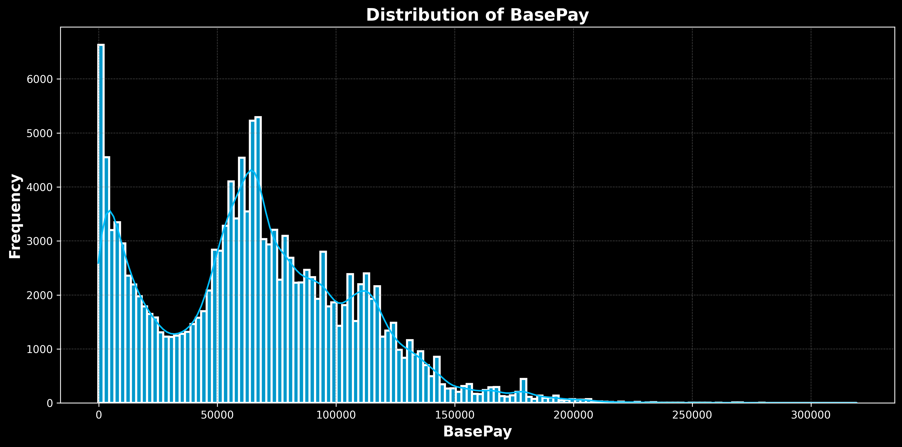
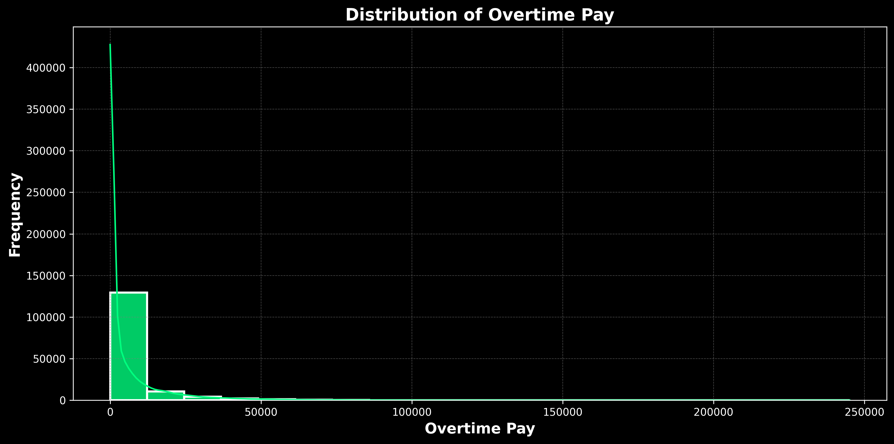
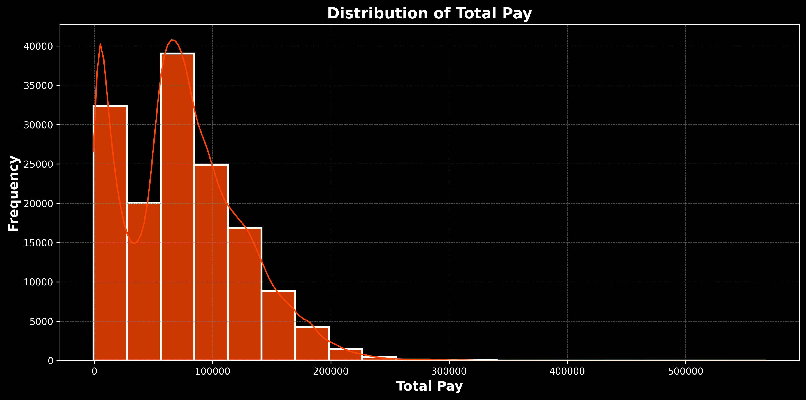
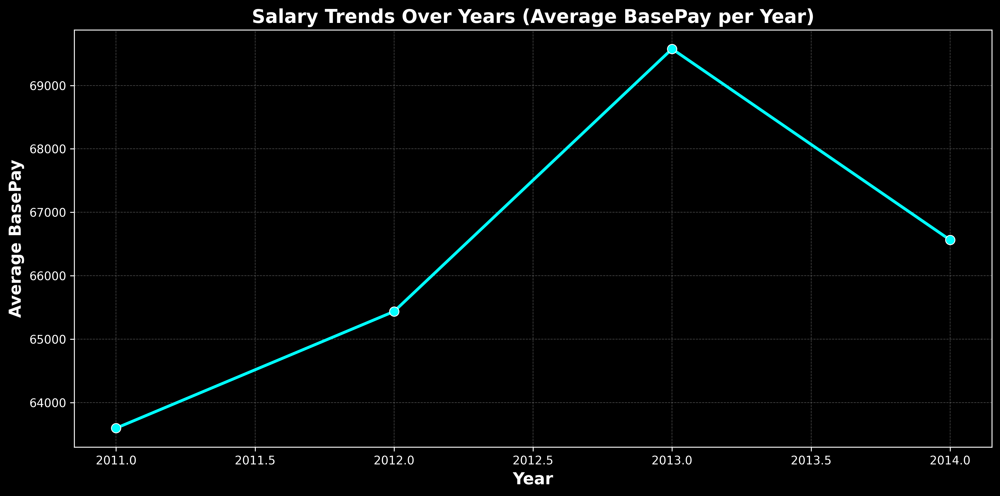
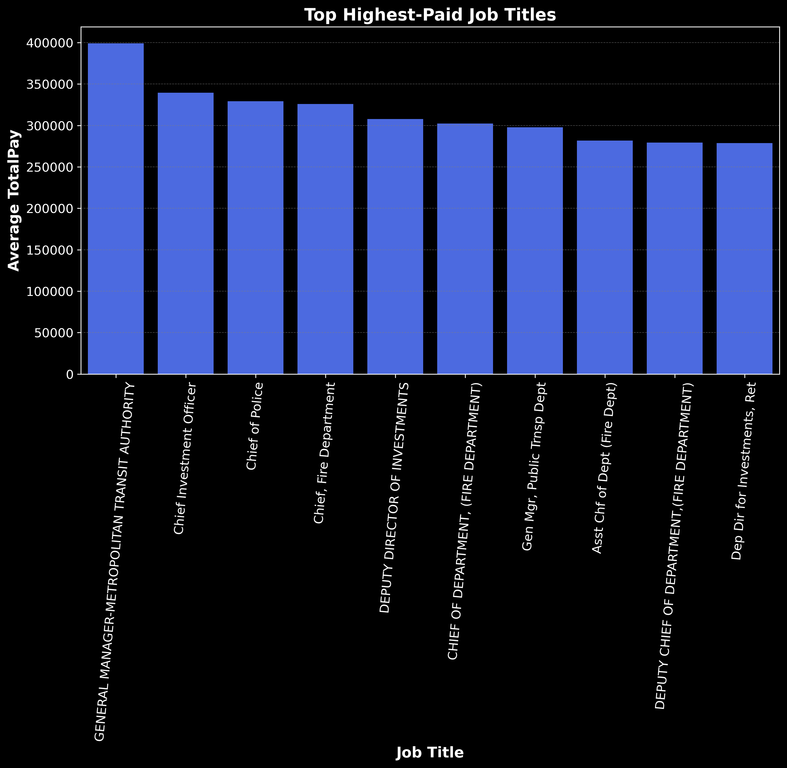
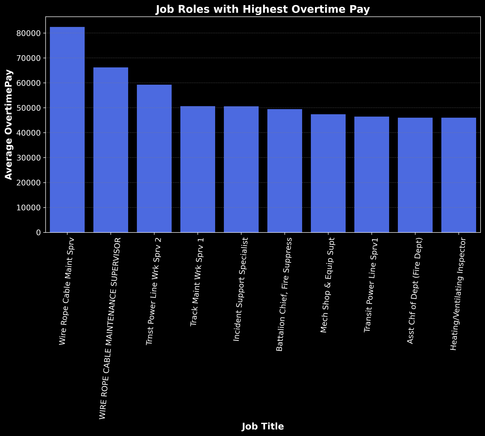
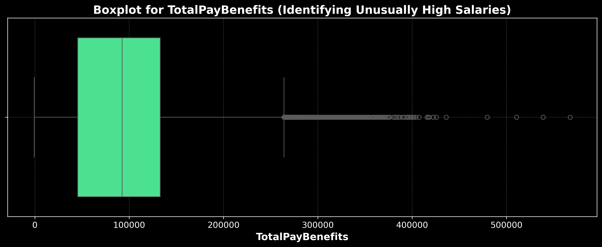
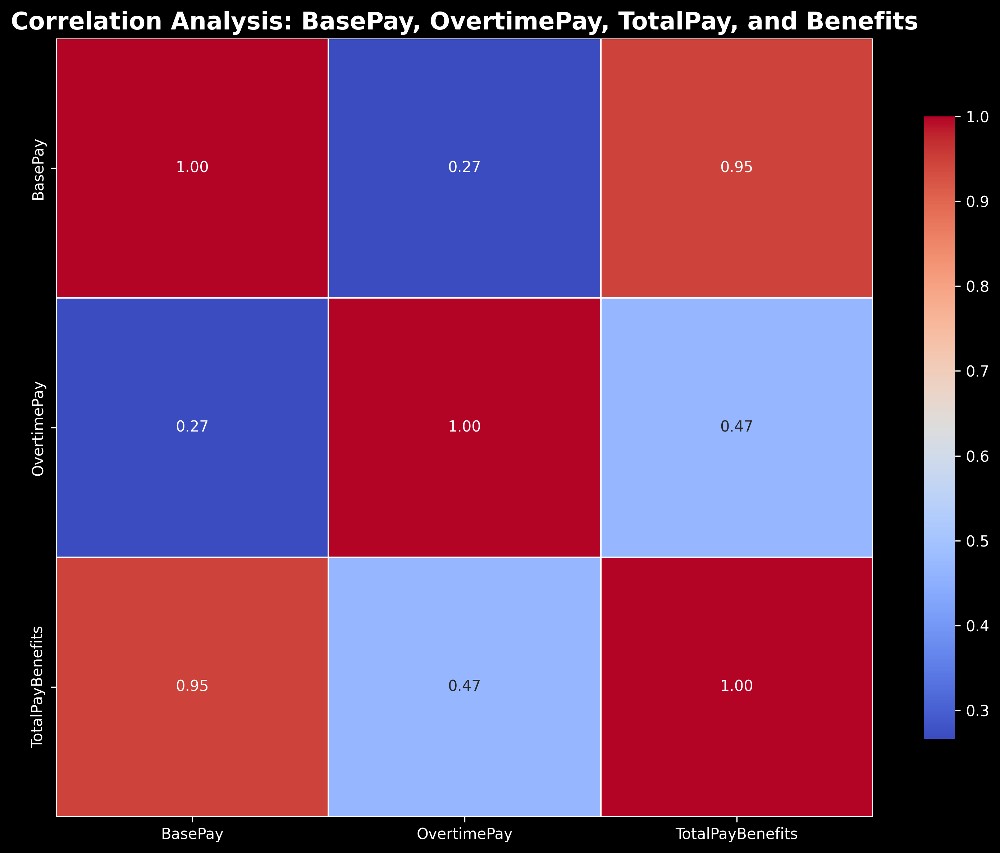

# Salary Data Analysis

## Overview
This project analyzes salary data to identify trends, distributions, and anomalies in employee compensation. The dataset has been cleaned, missing values handled, and various insights derived, including salary trends over the years, job roles with the highest pay, and correlations between different salary components.

## Features
- **Data Cleaning**: Handling missing values, converting data types, and removing irrelevant columns.
- **Descriptive Statistics**: Summary statistics before and after cleaning.
- **Distribution Analysis**: Visualizing the distributions of BasePay, OvertimePay, and TotalPay.
- **Salary Trends**: Analyzing salary trends over the years and total salary expenditure.
- **Job Analysis**: Identifying the highest-paid job titles and roles with the most overtime pay.
- **Outlier Detection**: Identifying extreme values in total compensation.
- **Correlation Analysis**: Understanding relationships between BasePay, OvertimePay, and TotalPayBenefits.

## Technologies Used
- **Python** (Pandas, NumPy, Matplotlib, Seaborn)
- **Jupyter Notebook**
- **Git & GitHub**

## Data Cleaning Process
1. Converted relevant columns to numeric types.
2. Filled missing values appropriately (mean for BasePay, 0 for others).
3. Dropped columns with excessive missing data.
4. Ensured TotalPay and TotalPayBenefits were correctly calculated.

## Visualizations & Insights
### Salary Distribution Analysis
- **BasePay Distribution**  
  

- **OvertimePay Distribution**  
  

- **TotalPay Distribution**  
  

### Salary Trends Over the Years
- **Average BasePay per Year**  
  

### Job Roles with Highest Pay
- **Top Paid Job Titles**  
  

### Job Roles with Highest Overtime Pay
- **Job Roles with Highest Overtime Pay**  
  

### Outlier Detection
- **Boxplot for TotalPayBenefits**  
  

### Correlation Analysis
- **Correlation Heatmap**  
  

## How to Run
1. Clone the repository:
   ```sh
   git clone https://github.com/MoustafaMohamed01/San-Francisco-salaries-Data-analysis.git
   ```
2. Install dependencies:

   Ensure you have Python **3.7+** installed. Then, install the         required libraries:  
    ```bash
    pip install -r requirements.txt
    ```

    Alternatively, install manually:
    ```sh
   pip install numpy pandas matplotlib seaborn
   ```

3. Run the Jupyter Notebook:
   ```sh
   jupyter notebook
   ```
4. Open the notebook and execute the cells to explore the analysis.

## Dataset
- The dataset contains salary-related information, including `BasePay`, `OvertimePay`, `OtherPay`, `Benefits`, `TotalPayBenefits`, and `TotalPay`.
- Contains variables such as `Id`, `EmployeeName`, `JobTitle`, `Year`, `Notes`, `Agency`, and `Status`
- The dataset was sourced from [Kaggle].
- The dataset link: [https://www.kaggle.com/datasets/kaggle/sf-salaries].

## Contributing
Contributions are welcome! Feel free to fork the repository, create a branch, and submit a pull request.
